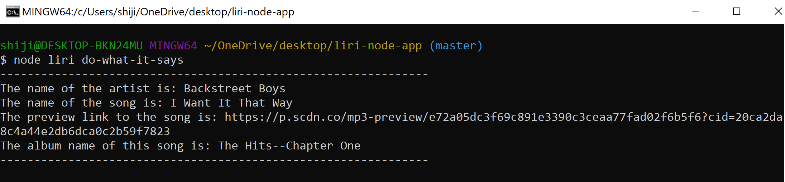

# liri-node-app

## What the project does?

LIRI is like iPhone’s SIRI. However, while SIRI is a Speech Interpretation and Recognition Interface, LIRI is a Language Interpretation and Recognition Interface. LIRI will be a command line node app that takes in parameters and gives you back data.

It has 4 different commands:

    1. concert-this
    2. spotify-this-song
    3. movie-this
    4. do-what-it-says

**concert-this** command lets you search concerts from [bandsintown.com](bandsintown.com)

**spotify-this-song** command lets you search a song from [Spotify](spotify.com)

**movie-this** command lets you search a movie from [IMDB API](imdb.com)

**do-what-it-says** command reads from a file named random.txt and does the command written in that text file

In addition to logging the data to the terminal/bash window, we also output the data to a text file called log.txt.

## Why the project is useful?

This project can be useful since the person can search 3 different types of entertainment things from the command line.

*EX: If I was working on my work projects and figuring out pushing and pulling conflicts and suddenly feel like going to a concert, I can just search it up from my command line without having to go to browser.*

## How to set up the app?

Step 1: Clone the repository to your desktop

Step 2: Open the gitbash/terminal window

Step 3: cd to desktop/liri-node-app

Now you can use the LIRI app.

`node liri concert-this <concert-name>`

`node liri spotify-this-song <song-name>`

`node liri movie-this <movie-name>`